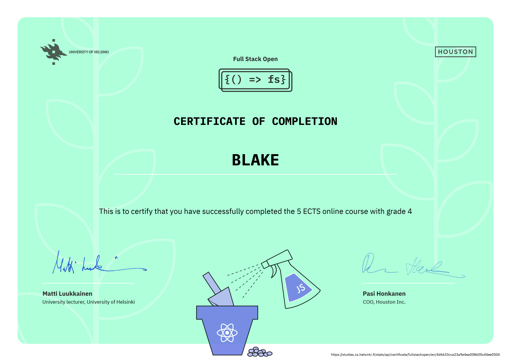

# Deep Dive Into Modern Web Development

## [Full Stack Open 2022](https://fullstackopen.com/en/)

Learn React, Redux, Node.js, MongoDB, GraphQL, TypeScript, React Native, GitHub Actions and Docker in one go! This course will introduce you to modern JavaScript-based web development. The main focus is on building single page applications with ReactJS that use REST APIs built with Node.js.

### [Part 0 - Fundamentals of Web apps](https://fullstackopen.com/en/part0)

- General Info
- Fundamentals of Web apps

### [Part 1 - Introduction to React](https://fullstackopen.com/en/part1)

- Introduction to React
- JavaScript
- Component State, event handlers
- A more complex state, debugging React apps

### [Part 2 - Communicating with server](https://fullstackopen.com/en/part2)
&ensp;&thinsp;&ensp;&thinsp;&ensp;&thinsp; \**[View Country/Weather Project](http://country.fly.dev/)*

- Rendering a collection, modules
- Forms
- Getting data from server
- Altering data in server
- Adding style to React apps

### [Part 3 - Programming a server with NodeJS and Express](https://fullstackopen.com/en/part3)
&ensp;&thinsp;&ensp;&thinsp;&ensp;&thinsp; \**[View Phonebook Project](https://crud-phonebook.fly.dev/)*

- Node.js and Express
- Deploying app to internet
- Saving data to MongoDB
- Validation and ESLint

### [Part 4 - Testing Express servers, user administration](https://fullstackopen.com/en/part4)

- Structure of backend application, introduction to testing
- Testing and backend
- User administration
- Token administration

### [Part 5 - Testing React apps](https://fullstackopen.com/en/part5)

- Login in frontend
- props.children and proptypes
- Testing React apps
- End to end testing

### [Part 6 - State management with Redux](https://fullstackopen.com/en/part6)

- [unicafe-redux](https://github.com/jeremy-ebinum/full-stack-open-2020/tree/master/part6/unicafe-redux) - rewrites the core of the unicafe exercise from part 1 using Redux state management
- [redux-anecdotes](https://github.com/jeremy-ebinum/full-stack-open-2020/tree/master/part6/redux-anecdotes) - rebuilds the anecdotes exercise from part 1 using Redux state management and adds REST operations with json-server and redux-thunk

### Full Stack Certificate - Parts 0-5

  

### Part 0 - [Fundamentals of Web apps](https://fullstackopen.com/en/part0)

An overall introduction to the course. It introduces to some concepts like HTTP requests, how traditional web apps work, DOM, CSS and Single Page Applications.

- [new note](/part0) - The diagram shows how communicate the browser and the server when user added a note to a page containing JavaScript.
- [single page app](/part0) - The diagram shows the communication between the browser and the server when user opened single page app on the browser.
- [new note (single page app)](/part0) - The diagram shows how communicate the browser and the server when user added a note to a single page app.

### Part 1 - [Introduction to React](https://fullstackopen.com/en/part1)

This part introduces to _React_ concepts. It covers the basics: components, props, _JSX_ and more advanced concepts: _Javascript_ functionalities that are used a lot in _React_ (`.map()`, `.filter()`, `.reduce()`), destructuring, event handlers in _React_ and passing state to child components, spread operator, hooks and their rules and conditional rendering.

- [courseinfo](/part1/src) - Simple course information page which counts total number of exercises of the course.
- [unicafe](/part1/src) - This app gathers feedbacks and makes statistic.
- [anecdotes](/part1/src) - This app provides to vote for a random anecdote, also shows the most voted anecdote.

### Part 2 - [Communicating with server](https://fullstackopen.com/en/part2)

This part covers how to display list items in _React_ and how to handle forms. Introduces _JSON server_ and fetching data from it, _axios_ for sending `GET`, `PUT`, `POST` and `DELETE` requests and how to style your _React_ app (CSS).

- [courseinfo](/part2/courseInfo) - Extended Course info app from part 1.
- [phonebook](/part2/phonebook) - Phonebook, add/delete contacts with numbers, edit numbers.
- [dataforcountries](/part2/countries) - A react app that fetches and displays information from the [REST Countries](https://restcountries.com) and [Open Weather Map](https://openweathermap.org/) API's.
- [Country/Weather App](http://country.fly.dev/) - The app deployed on Fly.io.

### Part 3 - [Programming a server with NodeJS and Express](https://fullstackopen.com/en/part3)

This part is focused on the backend. How to: implement a simple _REST API_ in _Node.js_ using _Express_, connect to a database (_MongoDB_) to store and retrieve data, deploy your app.

- [phonebook: backend](/part3/backend) - The app source backend code.
- [phonebook: frontend](/part3/frontend) - The app source frontend code.
- [Phonebook App](https://crud-phonebook.fly.dev/) - The app deployed on Heroku. Frontend from part 2 and Backend from part 3 works together.

### Part 4 - [Testing Express servers, user administration](https://fullstackopen.com/en/part4)

This part is focused on testing _Node.js_ applications, async/await, user administration, references across collections, token based authentication.

- [bloglist](/part4) - Allows users to save information (blog author, title, url, and amount of upvotes from users) about interesting blogs they have stumbled across on the internet.

### Part 5 - [Testing React apps](https://fullstackopen.com/en/part5)

This part is focused on token based authentication and testing the _React_ components using _Jest_, _React Testing Library_ and _Cypress_.

- [bloglist-frontend](/part5/bloglist-frontend) - The app frontend code.

### Part 6 - [State management with Redux](https://fullstackopen.com/en/part6)

This part is focused on _Redux_, which can be used for more complex state management of your _React_ app (covers concepts like immutability, global store, actions and reducers). Also this chapter covers how to use _Redux_ with `hooks`, and how to use the old `connect` higher order component when you work on older code bases, and `redux thunk` for asynchronous code.

- [unicafe-redux](/part6) - The app source code.
- [redux-anecdotes](/part6) - The app source code.
